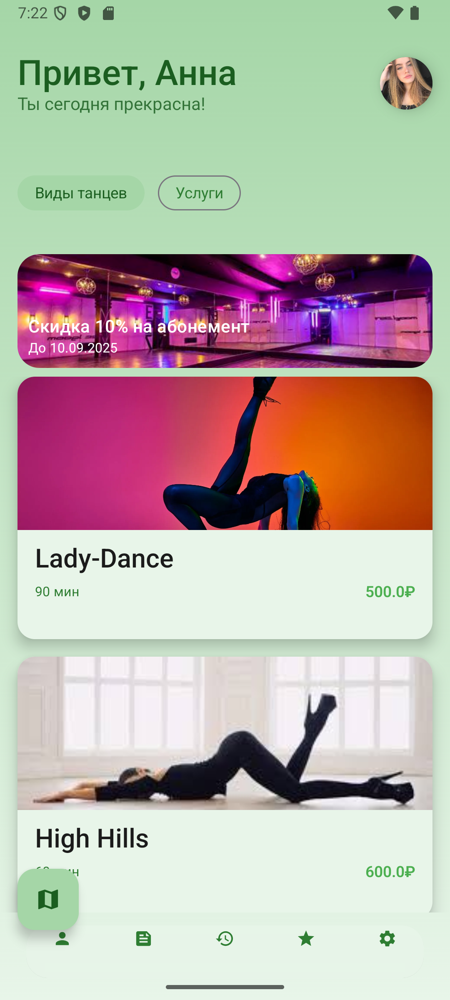


**💅 Beauty Salon App**

Современное мобильное приложение для салона красоты с функциями онлайн-бронирования и управления записями**
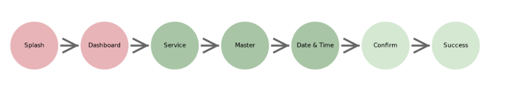
## 📱 Описание

Beauty Salon App — это элегантное Android-приложение, разработанное как финальный проект специально для салонов красоты, специализирующихся на услугах по уходу за волосами и маникюре. Приложение обеспечивает удобное бронирование услуг, выбор мастеров, управление расписанием и программу лояльности для клиентов.

## 🌟 Ключевые особенности:

- **Интуитивный интерфейс** с Material Design 3
    
- **Офлайн-первый подход** с синхронизацией в облаке
    
- **Персонализированные рекомендации** услуг
    
- **Real-time обновления** расписания мастеров
    
- **Программа лояльности** с накопительными баллами
    

## 📸 Скриншоты

<table> <tr> <td align="center"> 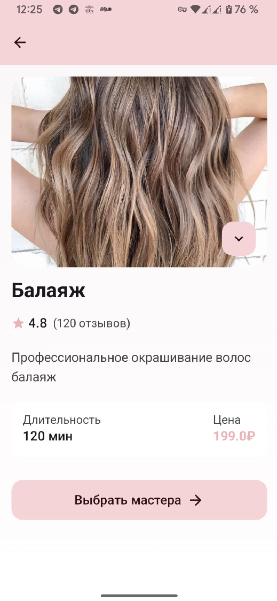<br/> <b>Создание записи</b><br/> Экран бронирования с информацией об услуге, мастере и времени </td> <td align="center"> <br/> <b>Главный экран</b><br/> Персонализированное приветствие и каталог услуг </td> <td align="center"> 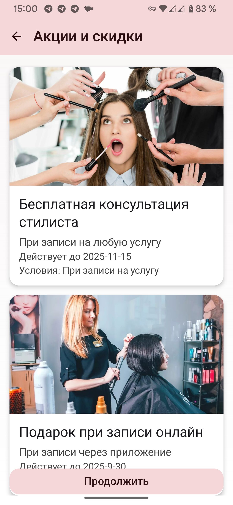<br/> <b>Промо-экран</b><br/> Реклама специальных предложений и терапии волос </td> </tr> <tr> <td align="center"> 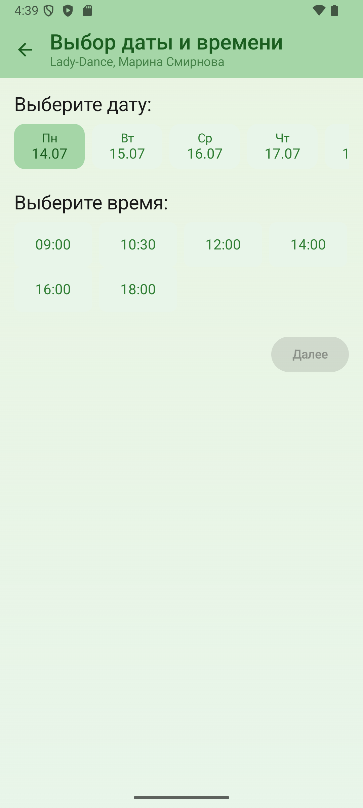<br/> <b>Календарь бронирования</b><br/> Выбор даты и времени для записи </td> <td align="center"> 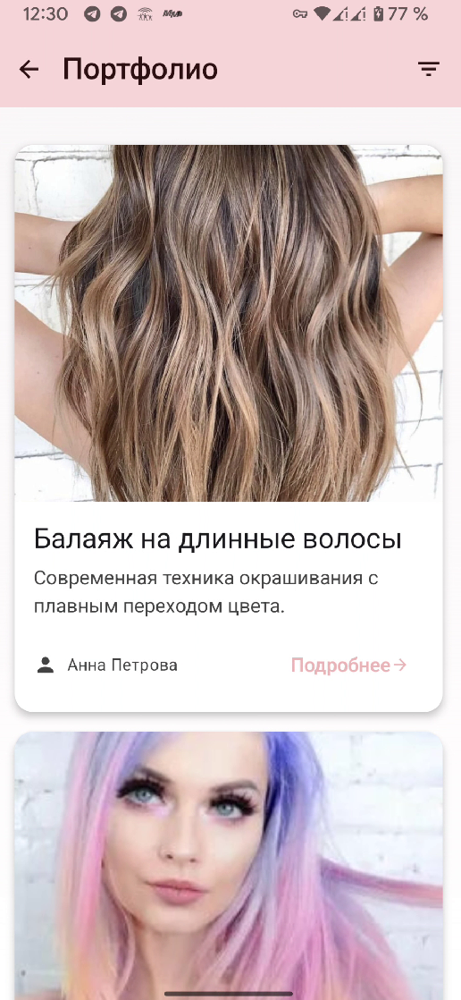<br/> <b>Портфолио</b><br/> Полный список услуг с фильтрацией </td> <td align="center"> 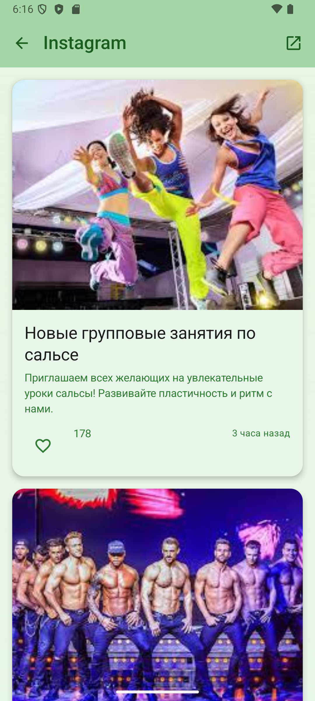<br/> <b>Лента работ Instagram</b><br/> Информация о мастере, рейтинг и отзывы </td> </tr> </table>

## 🛠 Используемые технологии

## **UX & UI**

- **Jetpack Compose** - современный UI toolkit для Android
    
- **Material Design 3** - дизайн-система с поддержкой динамических цветов
    
- **Navigation Compose** - типобезопасная навигация
    
- **Coil** - загрузка и кэширование изображений
    
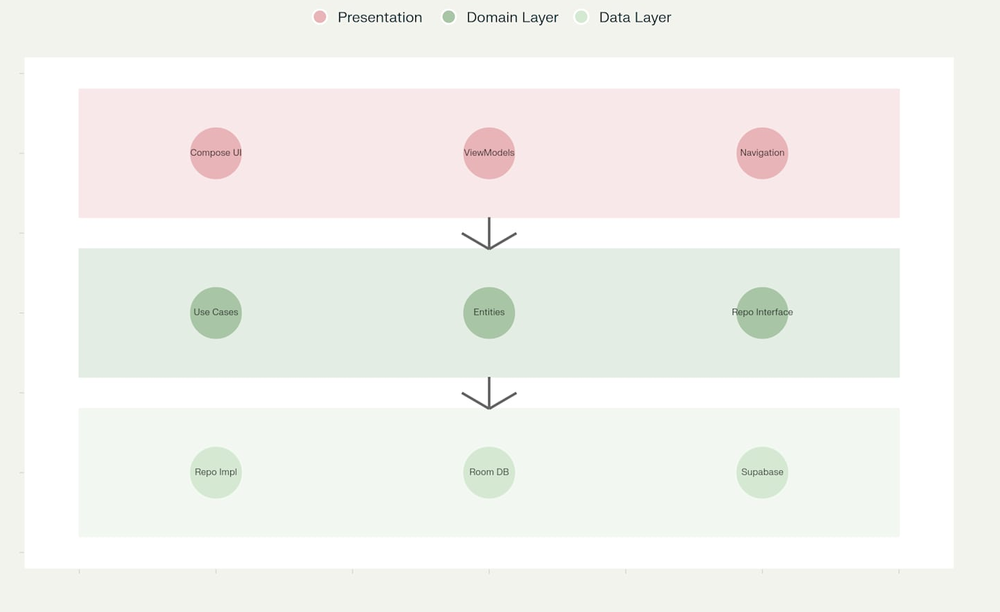
## **Архитектура & Управление состоянием**

- **MVVM + Clean Architecture** - разделение ответственности
    
- **Hilt** - dependency injection используется для упрощения настройки внедрения зависимостей
    
- **Coroutines & Flow** - асинхронное программирование и подгрузка данных в фоне
    
- **StateFlow** - управление состоянием при отображение UI
    
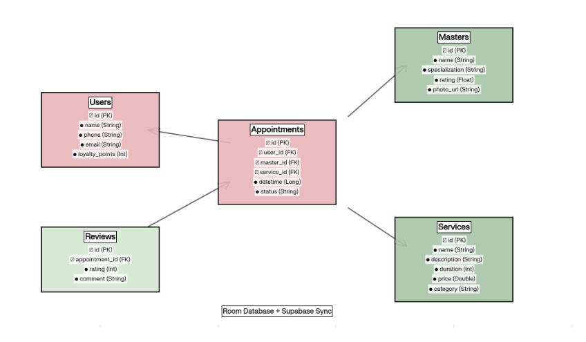
## **База данных**

- **Room Database** - для локального хранения данных
    
- **Supabase** - облачная база данных с real-time синхронизацией (кэширование и синхронизация записей и услуг)
    
- **Supabase Auth** - простая для интеграции аутентификация пользователей
    
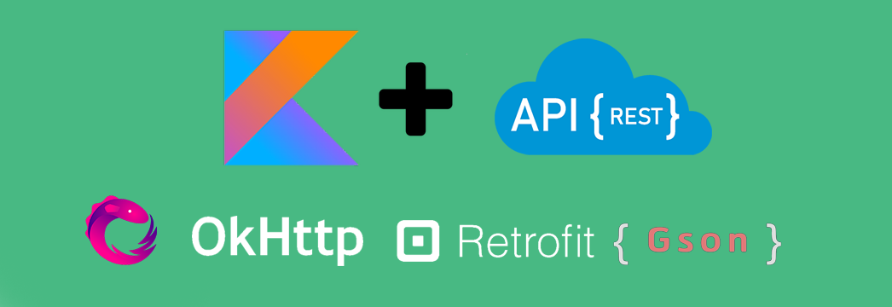
## **Дополнительные библиотеки**

- **Retrofit** - HTTP клиент
    
- **OkHttp**  **Gson** - сетевое взаимодействие
    
- **Material Icons Extended** - система иконок
    

## ⚙️ Настройка и установка
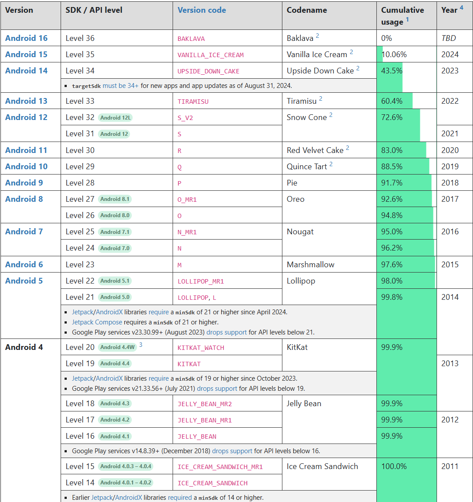
## **Минимальные требования**

Для сборки потребуется:

- Android SDK API Level 29
    
- Kotlin  2.1.21
    
- JDK 11

На самих устройствах должен быть установлен **Android 10** и выше
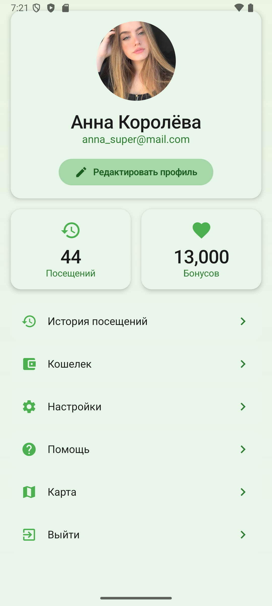
## 🎯 Функционал

✅ Готово
🕛 В процессе
📤Планируется
## **👤 Управление пользователями**

- 📤 Регистрация и авторизация (телефон, email, соцсети) в процессе
    
- 🕛 Персонализированный профиль пользователя 
    
- ✅ История посещений и услуг
    
- ✅ Настройки уведомлений и предпочтений
    

## **📅 Система бронирования**

- ✅ Каталог услуг с фильтрацией по категориям
    
- 🕛 Выбор мастера с просмотром рейтингов
    
- 🕛 Интерактивный календарь с доступными слотами
    
- ✅ Подтверждение записи с автоматическими напоминаниями
    
- 🕛 Отмена и перенос записей
    

## **💅 Услуги салона**

**Добавление услуг не ограниченно, осуществляется через бд.**

- ✅ **Волосы**: стрижка, окрашивание, укладка, восстановление
    
- ✅ **Ногти**: маникюр, педикюр, nail-арт
    
- ✅ Детальные описания отзывов на услуги с фотогалереей
    
- ✅ Калькулятор стоимости комплексных услуг
    

## **👨‍💼 Мастера**

- ✅ Профили мастеров с портфолио
    
- 🕛 Система рейтингов и отзывов
    
- 🕛 Расписание работы мастеров
    
- 🕛 Специализации и сертификаты
    

## **🎁 Программа лояльности**

- ✅ Накопление баллов за каждое посещение
    
- ✅ Персонализированные предложения
    
- ✅ Система скидок и промокодов
    
- 📤 Реферальная программа
    

## **📱 Дополнительные функции**

- 📤 Push-уведомления о записях и акциях
    
- 📤 Интеграция с календарем устройства
    
- ✅ Поддержка темной темы
    
- ✅ Офлайн-режим с автосинхронизацией
    


## 🏗 Архитектура

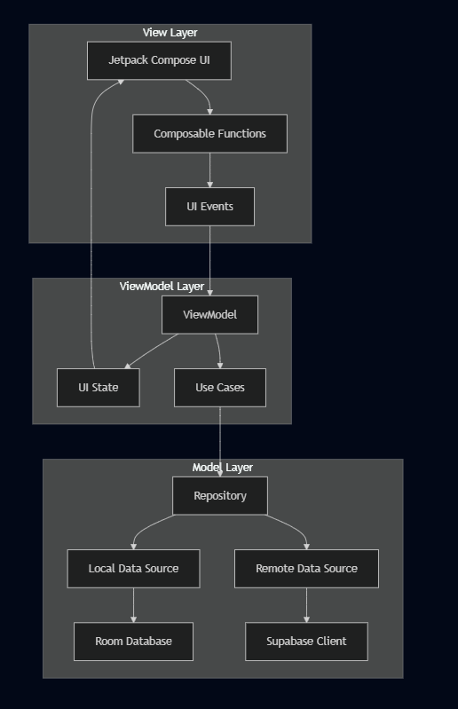
## **MVVM + Clean Architecture**

Приложение использует **MVVM (Model-View-ViewModel)** паттерн в сочетании с принципами **Clean Architecture** для обеспечения разделения ответственности и высокой тестируемости.

```android
📦 Presentation Layer (UI)
├── 🖥️ Composables (Jetpack Compose UI)
├── 🎯 ViewModels (UI State Management)
└── 🧭 Navigation (Screen Navigation)

📦 Domain Layer (Business Logic)
├── 🎯 Use Cases (Business Operations)
├── 📋 Entities (Domain Models)
└── 🔌 Repository Interfaces

📦 Data Layer (Data Management)
├── 🗄️ Repositories (Data Sources Orchestration)
├── 💾 Local DataSource (Room Database)
├── ☁️ Remote DataSource (Supabase)
└── 🔄 Synchronization (Offline-First)

```


## **Почему именно MVVM архитектура?**

**MVVM** (Model-View-ViewModel) — архитектурный паттерн, который помогает отделить логику представления от бизнес-логики и взаимодействия с данными. Этот паттерн стал стандартом для Android-приложений благодаря поддержке от Google и хорошей интеграции с компонентами Android Architecture Components.

1. **Разделение ответственности** - каждый слой имеет четкую роль
    
2. **Тестируемость** - легко создавать unit и integration тесты
    
3. **Масштабируемость** - простое добавление новых функций
    
4. **Maintenance** - изолированные изменения без влияния на другие слои
    
5. **Offline-First** - приложение работает без интернета
    


## 🚀 Будущие улучшения

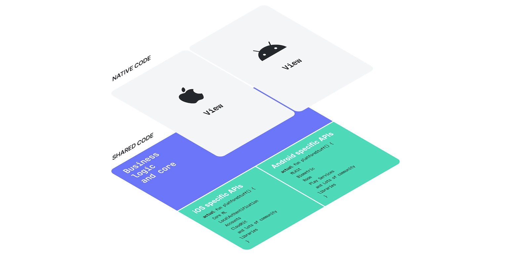
## **📈 Ближайшие планы

-  **Интеграция социальных функций (чат/видео и аудио звонок)** с мастерами и клиентами
    
-  **Интеграция с соцсетями** для шеринга результатов
    
-  **Система подарочных сертификатов**
    
-  **Мультиязычная поддержка**
    

## **🔮 Долгосрочное развитие**
    
-  **Тур по салону**
- Расширения для интеграции или создания приложений для других салонов
-  **Интеграция с системами оплаты**
    

## **🛠 Технические улучшения**

-  **Modularization** - разделение на модули и внедрение микро сервисов
    
-  **Compose Multiplatform** - переход на мультиплатформенную версию в 1 очередь iOS версия и веб-десктопные варианты
    
-  **Advanced Analytics** - расширенная аналитика по услугам и отзывам
    

## **🎨 UX/UI улучшения**

-  **Анимированные переходы** между экранами
    
-  **Кастомизация тем** под мастеров/пользователя и для других салнов
## **🗂️ Дополнительные файлы**

📝**Отчет по проекту** 
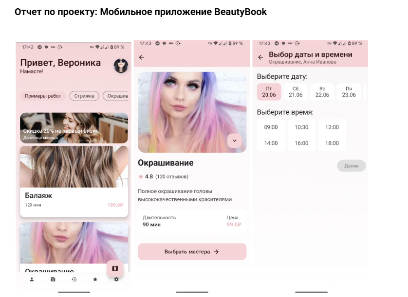

![[BeautyBook.docx]]

🗃️**Презентация**
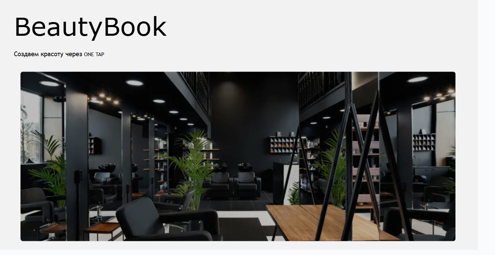


🗣️ **Выступление для защиты проекта**

[Выступление.docx](Выступление.docx) — полный текст выступления для защиты дипломного проекта, с примерами вопросов и ответов для комиссии.

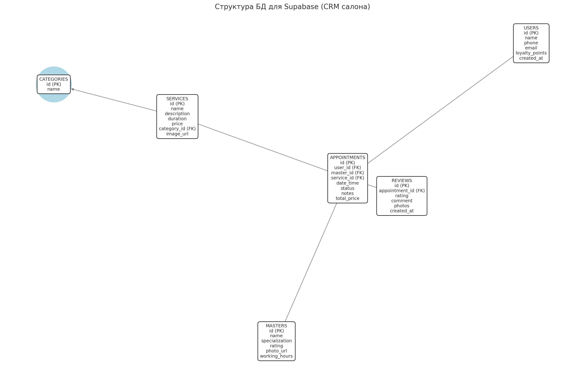


## 👨‍💻 Авторы

**Ваше Имя** Студент 1

- 📧 Email: [your.email@example.com](mailto:your.email@example.com)
    
- 💼 LinkedIn: [linkedin.com/in/yourprofile](https://linkedin.com/in/yourprofile)
    
- 🐱 GitHub: [@yourusername](https://github.com/yourusername)
    
- 📱 Telegram: [@yourusername](https://t.me/yourusername)
    

**Ваше Имя** Студент 2 

- 📧 Email: [your.email@example.com](mailto:your.email@example.com)
    
- 💼 LinkedIn: [linkedin.com/in/yourprofile](https://linkedin.com/in/yourprofile)
    
- 🐱 GitHub: [@yourusername](https://github.com/yourusername)
    
- 📱 Telegram: [@yourusername](https://t.me/yourusername)


## 📄 Лицензия


`MIT License Copyright (c) 2025 Android Course fevfev Permission is hereby granted, free of charge, to any person obtaining a copy of this software and associated documentation files (the "Software"), to deal in the Software without restriction, including without limitation the rights to use, copy, modify, merge, publish, distribute, sublicense, and/or sell copies of the Software, and to permit persons to whom the Software is furnished to do so, subject to the following conditions: The above copyright notice and this permission notice shall be included in all copies or substantial portions of the Software. THE SOFTWARE IS PROVIDED "AS IS", WITHOUT WARRANTY OF ANY KIND, EXPRESS OR IMPLIED, INCLUDING BUT NOT LIMITED TO THE WARRANTIES OF MERCHANTABILITY, FITNESS FOR A PARTICULAR PURPOSE AND NONINFRINGEMENT. IN NO EVENT SHALL THE AUTHORS OR COPYRIGHT HOLDERS BE LIABLE FOR ANY CLAIM, DAMAGES OR OTHER LIABILITY, WHETHER IN AN ACTION OF CONTRACT, TORT OR OTHERWISE, ARISING FROM, OUT OF OR IN CONNECTION WITH THE SOFTWARE OR THE USE OR OTHER DEALINGS IN THE SOFTWARE.`

---


---

							Сделано с ❤️ для индустрии красоты
